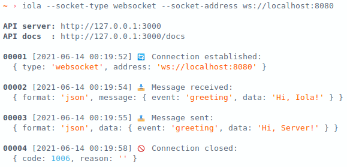

<h1 align="center">iola</h1>


### Demo


### Usage

```bash
$ iola -h

Iola is a socket client with rest api.

Usage: iola [options]

Options:
  -st, --socket-type <type>        * set socket type (types: "websocket")
  -sa, --socket-address <address>  * set socket address
  -ap, --api-port <port>             set api port (default: "3000")
  -ah, --api-host <host>             set api host (default: "localhost")
  -ne, --no-emoji                    disable emoji
  -v, --version                      print version
  -h, --help                         print help

Examples:
  iola --socket-type websocket --socket-address ws://localhost:8080

```
