<h1 align="center">🔄 iola</h1> 

<p align="center">
  <a href="https://github.com/pvarentsov/iola/blob/main/LICENSE">
    
  </a>
  <a href="https://www.npmjs.com/package/iola">
    
  </a>
  <a href="https://www.npmjs.com/package/iola">
    
  </a>
</p>

<details>
  <summary><b>Table of contents</b> (click to open)</summary>
  <br>
  <ul>
    <li><a href="https://github.com/pvarentsov/iola#description">Description</a></li>
    <li><a href="https://github.com/pvarentsov/iola#installation">Installation</a></li>
    <li><a href="https://github.com/pvarentsov/iola#usage">Usage</a></li>
    <ul>
      <li><a href="https://github.com/pvarentsov/iola#cli">CLI</a></li>
      <li><a href="https://github.com/pvarentsov/iola#rest-api">Rest API</a></li>
      <li><a href="https://github.com/pvarentsov/iola#clients">Clients</a></li>
        <ul>
          <li><a href="https://github.com/pvarentsov/iola#common">Common</a></li>
          <li><a href="https://github.com/pvarentsov/iola#websocket">WebSocket</a></li>
          <li><a href="https://github.com/pvarentsov/iola#socketio">SocketIO</a></li>
        </ul>
    </ul>
    <li><a href="https://github.com/pvarentsov/iola#license">License</a></li>
  </ul>
</details>

## Description

**iola** - a socket client with rest api. It helps to work with socket servers using your favorite rest client.

<p align="center"> 
  
</p>

**Features:**

1. Read messages via rest api
2. Send messages via rest api
3. Log all socket events in console

**Roadmap**:
- [ ] Implement clients
  - [x] WebSocket
  - [x] SocketIO
  - [ ] Tcp
  - [ ] Unix-socket
- [ ] Add application's binaries for all popular platforms


## Installation
```bash
$ npm install -g iola
```
## Usage

### CLI

<pre>
$ iola --help

<b>iola</b> - a socket client with rest api

Usage: iola [options] [command]

Options:
  --version                         Display version
  --help                            Display help

Commands:
  websocket|ws [options] &lt;address>  Run websocket client
  socketio|io [options] &lt;address>   Run socket.io client
  help [command]                    Display help for command

API:
  GET  /messages                    Get message list
  GET  /messages/{id}               Get message by id
  POST /messages                    Send message 
  GET  /docs                        Get api documentation
</pre>

### Rest API

<p align="center">
  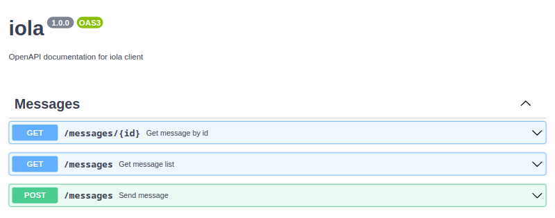
</p>

<details>
  <summary>get message</summary>
  <p align="center">
    <br>
    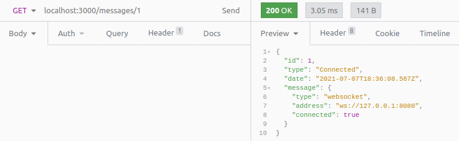
  </p>
</details>

<details>
  <summary>get message list</summary>
  <p align="center">
    <br>
    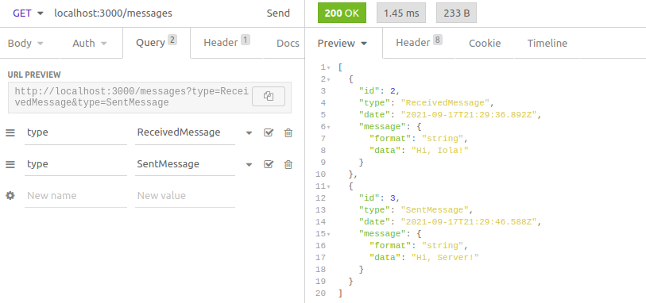
  </p>
</details>


<details>
  <summary>send any data</summary>
  <p align="center">
    <br>
    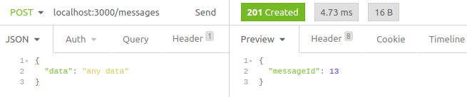
  </p>
</details>

<details>
  <summary>send binary data (uint8 array)</summary>
  <p align="center">
    <br>
    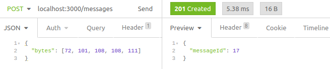
  </p>
</details>

### Clients

#### Common

All socket clients have the next options:

<table border="0">
<tr>
  <td nowrap><code>--api-port &lt;port&gt;</code></td>
  <td>Set API port.</td>
</tr>
<tr>
  <td nowrap><code>--api-host &lt;host&gt;</code></td>
  <td>Set API host.</td>
</tr>
<tr>
  <td nowrap><code>--binary-encoding  &lt;encoding&gt;</code></td>
  <td>Encode <code>sent</code>/<code>received</code> binary messages for more readability. Supported encodings: 
    <code>ascii</code>,
    <code>utf8</code>,
    <code>base64</code>,
    <code>hex</code>.
    <br>
    <br>
    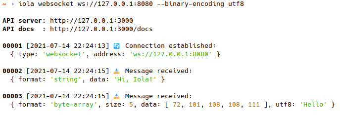
    <br>
    <br>
    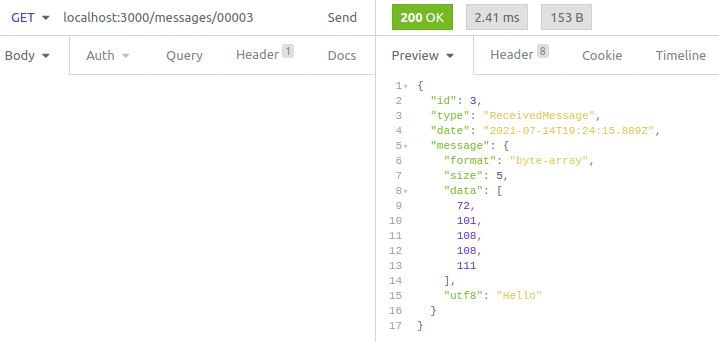
  </td>
</tr>
<tr>
  <td nowrap><code>--no-emoji</code></td>
  <td>Disable emoji in the console.</td>
</tr>
</table>

#### WebSocket

<pre>
$ iola help websocket

Usage: iola websocket [options] <address>

Run websocket client

Options:
  -ap, --api-port &lt;port>             Set api port (default: "3000")
  -ah, --api-host &lt;host>             Set api host (default: "127.0.0.1")
  -rt, --reply-timeout &lt;timeout>     Set reply timeout in ms (default: "2000")
  -be, --binary-encoding &lt;encoding>  Set binary encoding (choices: "ascii","utf8","base64","hex")
  -ne, --no-emoji                    Disable emoji
  -h, --help                         Display help

Examples:
  iola websocket ws://127.0.0.1:8080
  iola websocket ws://127.0.0.1:8080/?token=secret
  iola websocket ws://127.0.0.1:8080 --binary-encoding utf8
  iola websocket ws://127.0.0.1:8080 --reply-timeout 3000 --no-emoji
</pre>

<details>
  <summary>message formats</summary>
  <br>
  <ul>
    <li><code>string</code></li>
    <li><code>json</code></li>
    <li><code>byte-array</code></li>
  </ul>
</details>

<details>
  <summary>server reply</summary>
  <br>
  <p>You can pass the RequestId to the request with json data
     in order to await the server reply with such RequestId in the reply data.
  </p>
  <p align="center">
    <br>
    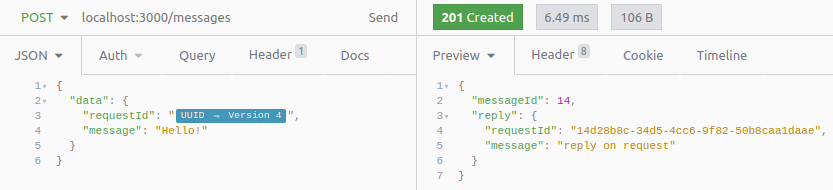
  </p>
  <p>RequestId field can be one of the following:
    <ul>
      <li><code>requestId</code></li>
      <li><code>request_id</code></li>
      <li><code>reqId</code></li>
      <li><code>req_id</code></li>
      <li><code>traceId</code></li>
      <li><code>trace_id</code></li>
    </ul>
  </p>
  <p>
    Default reply timeout is 2000 ms. To change it you can set <code>--reply-timeout &lt;timeout&gt</code> option.
  </p>
</details>

#### SocketIO

<pre>
$ iola help socketio
 
Usage: iola socketio|io [options] <address>

Run socket.io client

Options:
  -ap, --api-port &lt;port>             Set api port (default: "3000")
  -ah, --api-host &lt;host>             Set api host (default: "127.0.0.1")
  -t, --transport &lt;transport>        Set transport (choices: "polling","websocket")
  -rt, --reply-timeout &lt;timeout>     Set reply timeout in ms (default: "2000")
  -be, --binary-encoding &lt;encoding>  Set binary encoding (choices: "ascii","utf8","base64","hex")
  -ne, --no-emoji                    Disable emoji
  -h, --help                         Display help

Examples: 
  iola socketio http://127.0.0.1:8080 
  iola io http://127.0.0.1:8080/?token=secret --transport websocket
  iola socketio http://127.0.0.1:8080 --binary-encoding utf8 
  iola socketio http://127.0.0.1:8080 --reply-timeout 3000 --no-emoji
</pre>

<details>
  <summary>message formats</summary>
  <br>
  <ul>
    <li><code>string</code></li>
    <li><code>number</code></li>
    <li><code>boolean</code></li>
    <li><code>null</code></li>
    <li><code>json</code></li>
    <li><code>byte-array</code></li>
  </ul>
</details>

<details>
  <summary>transport</summary>
  <br>
  <p>
    Client supports "websocket" and "polling" transports. It tries to use "websocket" first, if available.
  </p>
  <p>
    You can explicitly set the type of transport using <code>--transport &lt;transport></code> option.
  </p>
</details>

<details>
  <summary>emit event</summary>
  <br>
  <p>Emit any data</p>
  <p align="center">
    <br>
    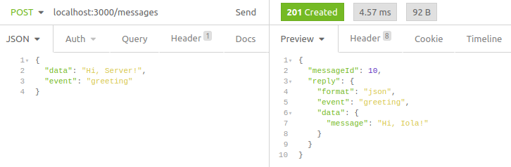
  </p>
  <p>Emit binary data</p>
  <p align="center">
    <br>
    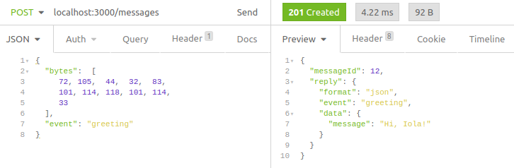
  </p>
</details>

<details>
  <summary>server reply</summary>
  <br>
  <p>
    SocketIO supports server replies. This feature is named acknowledgements.
  </p>
  <p>
    Default reply timeout is 2000 ms. To change it you can set <code>--reply-timeout &lt;timeout&gt</code> option.
  </p>
</details>

<details>
  <summary>cli example</summary>
  <br>
  <p align="center">
    <br>
    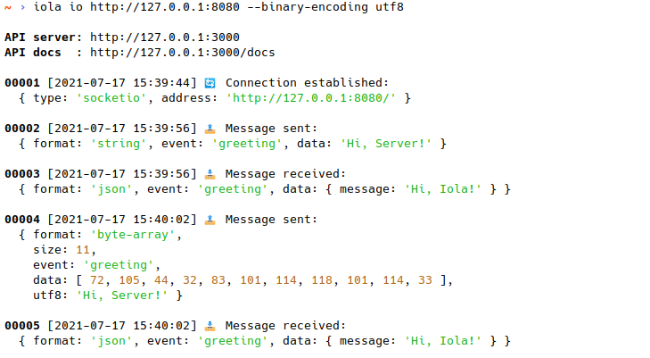
  </p>
</details>
  
## License

This project is licensed under the [MIT License](https://github.com/pvarentsov/iola/blob/main/LICENSE).
