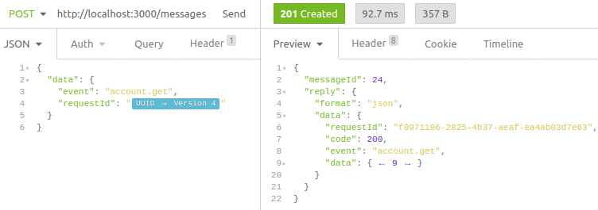
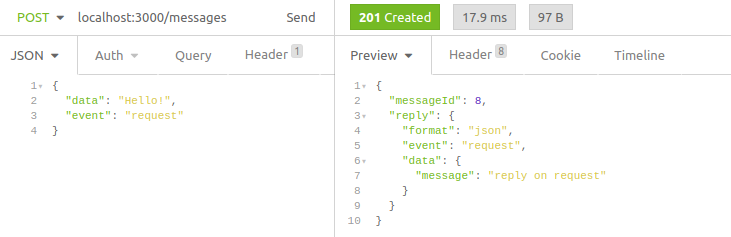
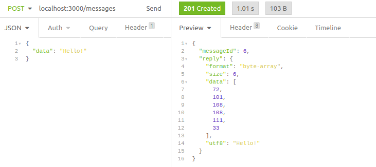

<h1 align="center">🔄 iola</h1> 

<p align="center">
  <a href="https://github.com/pvarentsov/iola/blob/main/LICENSE">
    
  </a>
  <a href="https://www.npmjs.com/package/iola">
    
  </a>
  <a href="https://www.npmjs.com/package/iola">
    
  </a>
</p>

<details>
  <summary><b>Table of contents</b> (click to open)</summary>
  <br>
  <ul>
    <li><a href="#description">Description</a></li>
    <li><a href="#installation">Installation</a></li>
    <li><a href="#usage">Usage</a></li>
    <ul>
      <li><a href="#cli">CLI</a></li>
      <li><a href="#rest-api">REST API</a></li>
    </ul>
    <li><a href="#clients">Clients</a></li>
      <ul>
        <li><a href="#common">Common</a></li>
        <li><a href="#websocket">WebSocket</a></li>
        <li><a href="#socketio">Socket.IO</a></li>
        <li><a href="#tcp--unix-socket">TCP & Unix socket</a></li>
      </ul>
    <li><a href="https://github.com/pvarentsov/iola#license">License</a></li>
  </ul>
</details>

## Description

**iola** - a socket client with REST API. It helps to work with socket servers using your favorite REST client.

<p align="center"> 
  
</p>

**iola** tries to simplify socket server testing and support the most popular socket clients.
The main way to interact with the tool is the REST API. 
This approach allows you to use the rich functionality of modern REST clients to work with sockets.

The potential of the tool is revealed when using API clients such as [Postman](https://www.postman.com/), [Insomnia](https://insomnia.rest/), etc.
You can manage collections of requests for projects that have socket-based API, use dynamic variables in requests and many other features supported by these clients.

**Features:**

1. Allows reading and sending messages via REST API
2. Logs all socket events in the console
3. Has Swagger UI for REST API
4. Works on Linux, MacOS and Windows

**Supported clients:**

1. WebSocket
2. Socket.IO
3. TCP
4. Unix socket

## Installation

**Via npm** (for all platforms where [Node.js](https://nodejs.org/en/) is installed).

```bash
$ npm install -g iola
```

**Via homebrew** (MacOS and Linux).
```bash
$ brew tap pvarentsov/iola
$ brew install iola
```

**Or download** standalone binary from [releases](https://github.com/pvarentsov/iola/releases).

## Usage

### CLI

<pre>
$ iola --help

<b>iola</b> - a socket client with REST API

Usage: iola [options] [command]

Options:
  --version                         Display version
  --help                            Display help

Commands:
  websocket|ws [options] &lt;address>  Run websocket client
  socketio|io [options] &lt;address>   Run socket.io client
  tcp [options] &lt;address>           Run tcp client
  unix [options] &lt;address>          Run unix client
  help [command]                    Display help for command

API:
  GET  /messages                    Get message list
  GET  /messages/{id}               Get message by id
  POST /messages                    Send message 
  GET  /swagger                     Get swagger
</pre>

### REST API

<p align="center">
  
</p>

Get message:
<p>
  <br>
  
</p>

Get message list:
<p>
  <br>
  
</p>

Send any data:
<p>
  <br>
  
</p>
<p>
  <br>
  
</p>

Send binary data (uint8 array):
<p>
  <br>
  
</p>

## Clients

### Common

All socket clients have the next options:

<table border="0">
<tr>
  <td nowrap><code>--api-port &lt;port&gt;</code></td>
  <td>Set API port (default: "3000").</td>
</tr>
<tr>
  <td nowrap><code>--api-host &lt;host&gt;</code></td>
  <td>Set API host (default: "127.0.0.1").</td>
</tr>
<tr>
  <td nowrap><code>--binary-encoding  &lt;encoding&gt;</code></td>
  <td>Encode <code>sent</code>/<code>received</code> binary messages for more readability. Supported encodings: 
    <code>ascii</code>,
    <code>utf8</code>,
    <code>base64</code>,
    <code>hex</code>.
    <br>
    <br>
    
    <br>
    <br>
    
  </td>
</tr>
<tr>
  <td nowrap><code>--no-emoji</code></td>
  <td>Disable emoji in the console.</td>
</tr>
</table>

### WebSocket

<pre>
$ iola help websocket

Usage: iola websocket|ws [options] &lt;address>

Run websocket client

Options:
  -ap, --api-port &lt;port>             Set api port (default: "3000")
  -ah, --api-host &lt;host>             Set api host (default: "127.0.0.1")
  -h, --header &lt;key:value...>        Set http headers
  -rt, --reply-timeout &lt;timeout>     Set reply timeout in ms (default: "1000")
  -be, --binary-encoding &lt;encoding>  Set binary encoding (choices: "ascii","utf8","base64","hex")
  -ne, --no-emoji                    Disable emoji
  --help                             Display help

Examples:
  <b>$</b> iola websocket ws://127.0.0.1:8080
  <b>$</b> iola ws ws://127.0.0.1:8080/?token=secret
  <b>$</b> iola ws ws://127.0.0.1:8080 --header authorization:"Bearer token"
  <b>$</b> iola websocket ws://127.0.0.1:8080 --binary-encoding utf8
  <b>$</b> iola websocket ws://127.0.0.1:8080 --reply-timeout 3000 --no-emoji
</pre>

<details>
  <summary>message formats</summary>
  <br>
  <ul>
    <li><code>string</code></li>
    <li><code>json</code></li>
    <li><code>byte-array</code></li>
  </ul>
</details>

<details>
  <summary>http headers</summary>
  <br>
  <p>
    You can pass http headers using <code>--header &lt;key:value...></code> option. Examples:
    <ul>
      <li><code>iola ws ws://127.0.0.1:8080 --header authorization:"Bearer token"</code></li>
      <li><code>iola ws ws://127.0.0.1:8080 -h content-type:application/json -h content-length:42</code></li>
    </ul>
  </p>
</details>

<details>
  <summary>server reply</summary>
  <br>
  <p>You can pass the RequestId to the request with json data
     in order to await the server reply with such RequestId in the reply data.
  </p>
  <p align="center">
    <br>
    
  </p>
  <p>RequestId field can be one of the following:
    <ul>
      <li><code>requestId</code></li>
      <li><code>request_id</code></li>
      <li><code>reqId</code></li>
      <li><code>req_id</code></li>
      <li><code>traceId</code></li>
      <li><code>trace_id</code></li>
    </ul>
  </p>
  <p>
    Default reply timeout is 1000 ms. To change it you can set <code>--reply-timeout &lt;timeout&gt</code> option.
  </p>
</details>

### Socket.IO

**iola** relies on Socket.IO v4. Please check a [version compatibility](https://socket.io/docs/v4/client-installation/#Version-compatibility).

<pre>
$ iola help socketio
 
Usage: iola socketio|io [options] &lt;address>

Run socket.io client

Options:
  -ap, --api-port &lt;port>             Set api port (default: "3000")
  -ah, --api-host &lt;host>             Set api host (default: "127.0.0.1")
  -h, --header &lt;key:value...>        Set http headers
  -a, --auth &lt;key:value...>          Set authentication payload
  -t, --transport &lt;transport>        Set transport (choices: "polling","websocket")
  -rt, --reply-timeout &lt;timeout>     Set reply timeout in ms (default: "1000")
  -be, --binary-encoding &lt;encoding>  Set binary encoding (choices: "ascii","utf8","base64","hex")
  -ne, --no-emoji                    Disable emoji
  --help                             Display help

Examples: 
  <b>$</b> iola socketio http://127.0.0.1:8080 
  <b>$</b> iola io http://127.0.0.1:8080/?token=secret --transport websocket
  <b>$</b> iola io http://127.0.0.1:8080 --header authorization:"Bearer token"  
  <b>$</b> iola io http://127.0.0.1:8080 --auth user:iola --auth pass:qwerty1
  <b>$</b> iola socketio http://127.0.0.1:8080 --binary-encoding utf8 
  <b>$</b> iola socketio http://127.0.0.1:8080 --reply-timeout 3000 --no-emoji
</pre>

<details>
  <summary>message formats</summary>
  <br>
  <ul>
    <li><code>string</code></li>
    <li><code>number</code></li>
    <li><code>boolean</code></li>
    <li><code>null</code></li>
    <li><code>json</code></li>
    <li><code>byte-array</code></li>
  </ul>
</details>

<details>
  <summary>transport</summary>
  <br>
  <p>
    Client supports "websocket" and "polling" transports. It tries to use "websocket" first, if available.
  </p>
  <p>
    You can explicitly set the type of transport using <code>--transport &lt;transport></code> option.
  </p>
</details>

<details>
  <summary>http headers</summary>
  <br>
  <p>
    You can pass http headers using <code>--header &lt;key:value...></code> option. Examples:
    <ul>
      <li><code>iola io http://127.0.0.1:8080 --header authorization:"Bearer token"</code></li>
      <li><code>iola io http://127.0.0.1:8080 -h content-type:application/json -h content-length:42</code></li>
    </ul>
  </p>
</details>

<details>
  <summary>auth</summary>
  <br>
  <p>
    Socket.IO client can send credentials with the <a href="https://socket.io/docs/v4/middlewares/#Sending-credentials">auth option</a>.
  </p>
  <p>
    You can set the auth payload using <code>--auth &lt;key:value...></code> option. Examples:
    <ul>
      <li><code>iola io http://127.0.0.1:8080 --auth user:iola --auth pass:qwerty1</code></li>
      <li><code>iola io http://127.0.0.1:8080 --a token:"super secret"</code></li>
    </ul>
  </p>
</details>

<details>
  <summary>send data</summary>
  <br>
  <p>Send any data</p>
  <p align="center">
    <br>
    
  </p>
  <p>Send binary data</p>
  <p align="center">
    <br>
    
  </p>
</details>

<details>
  <summary>server reply</summary>
  <br>
  <p>
    Socket.IO supports server replies. This feature is named acknowledgements.
  </p>
  <p align="center">
    <br>
    
  </p>
  <p>
    Default reply timeout is 1000 ms. To change it you can set <code>--reply-timeout &lt;timeout&gt</code> option.
  </p>
</details>

### TCP & Unix socket

TCP and Unix socket clients have the same api. 

**TCP**

<pre>
$ iola help tcp
 
Usage: iola tcp [options] &lt;address>

Run tcp client

Options:
  -ap, --api-port &lt;port>             Set api port (default: "3000")
  -ah, --api-host &lt;host>             Set api host (default: "127.0.0.1")
  -s, --sync                         Enable sync mode
  -rt, --reply-timeout &lt;timeout>     Set reply timeout in ms (sync mode only) (default: "1000")
  -be, --binary-encoding &lt;encoding>  Set binary encoding (choices: "ascii","utf8","base64","hex")
  -ne, --no-emoji                    Disable emoji
  --help                             Display help

Examples: 
  <b>$</b> iola tcp 127.0.0.1:8080
  <b>$</b> iola tcp 127.0.0.1:8080 --sync
  <b>$</b> iola tcp 127.0.0.1:8080 --binary-encoding utf8 
  <b>$</b> iola tcp 127.0.0.1:8080 --no-emoji

</pre>

**Unix socket**

<pre>
$ iola help unix
 
Usage: iola unix [options] &lt;address>

Run unix client

Options:
  -ap, --api-port &lt;port>             Set api port (default: "3000")
  -ah, --api-host &lt;host>             Set api host (default: "127.0.0.1")
  -s, --sync                         Enable sync mode
  -rt, --reply-timeout &lt;timeout>     Set reply timeout in ms (sync mode only) (default: "1000")
  -be, --binary-encoding &lt;encoding>  Set binary encoding (choices: "ascii","utf8","base64","hex")
  -ne, --no-emoji                    Disable emoji
  --help                             Display help

Examples: 
  <b>$</b> iola unix ./unix.sock
  <b>$</b> iola unix ./unix.sock --sync
  <b>$</b> iola unix ./unix.sock --binary-encoding utf8 
  <b>$</b> iola unix ./unix.sock --no-emoji

</pre>

Clients support async and sync modes and use async mode by default.

In async mode, the client and the server exchange messages independently within one connection.

Sync mode uses a request/response protocol. The client opens a new connection for each request, the server responds.
The connection is closed either on the server side after a successful response or by a timeout on the client side.

<details>
  <summary>message formats</summary>
  <br>
  <ul>
    <li><code>byte-array</code></li>
  </ul>
</details>

<details>
  <summary>sync mode</summary>
  <br>
  <p>
    To enable sync mode need to set <code>--sync</code> option.
  </p>
</details>

<details>
  <summary>server reply</summary>
  <br>
  <p>
    Server replies are supported only in sync mode. If the server does not close the connection, the client will close it on its own during the reply timeout.
  </p>
  <p align="center">
    <br>
    
  </p>
  <p>
    Default reply timeout is 1000 ms. To change it you can set <code>--reply-timeout &lt;timeout&gt</code> option.
  </p>
</details>

## License

This project is licensed under the [MIT License](https://github.com/pvarentsov/iola/blob/main/LICENSE).
