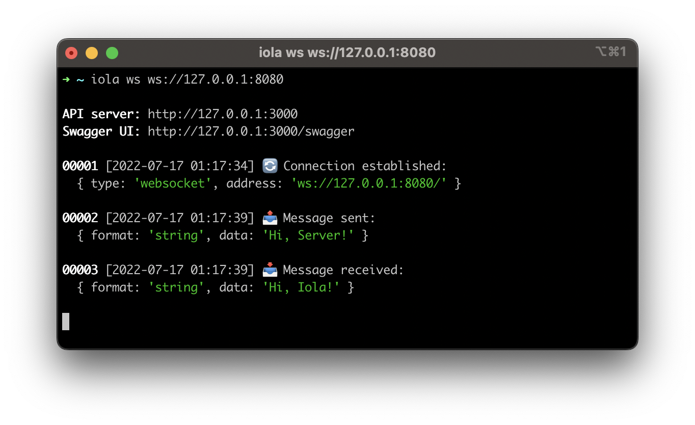

<h1 align="center">🔄 iola</h1> 

<p align="center">
  <a href="https://github.com/pvarentsov/iola/blob/main/LICENSE">
    
  </a>
  <a href="https://www.npmjs.com/package/iola">
    
  </a>
  <a href="https://www.npmjs.com/package/iola">
    
  </a>
  <br> 
  <a href="">
    
  </a>  
  <a href="">
    
  </a>
</p>

<details>
  <summary><b>Table of contents</b> (click to open)</summary>
  <br>
  <ul>
    <li><a href="#description">Description</a></li>
    <li><a href="#installation">Installation</a></li>
    <li><a href="#usage">Usage</a></li>
    <ul>
      <li><a href="#cli">CLI</a></li>
      <li><a href="#rest-api">REST API</a></li>
    </ul>
    <li><a href="#websocket">WebSocket</a></li>
    <li><a href="#socketio">Socket.IO</a></li>
    <li><a href="#tcp--unix-socket">TCP & Unix socket</a></li>
    <li><a href="#license">License</a></li>
  </ul>
</details>

## Description

**iola** - a command-line socket client with REST API. It helps to work with socket servers using your favorite REST client.

<p align="center"> 
  
</p>

**iola** tries to simplify socket server testing and support the most popular socket clients.
The main way to interact with the tool is the REST API. 
This approach allows you to use the rich functionality of modern REST clients to work with sockets.

The potential of the tool is revealed when using API clients such as [Postman](https://www.postman.com/), [Insomnia](https://insomnia.rest/), etc.
You can manage collections of requests for projects that have socket-based API, use dynamic variables in requests and many other features supported by these clients.

**Features:**

1. Allows reading and sending messages via REST API
2. Logs all socket events in the console
3. Has Swagger UI for REST API
4. Works on Linux, macOS and Windows

**Supported clients:**

1. WebSocket
2. Socket.IO
3. TCP
4. Unix socket

## Installation

**Via npm** (for all platforms where [Node.js](https://nodejs.org/en/) >= 12 is installed).

```bash
$ npm install -g iola
```

**Via homebrew** (Linux, macOS).
```bash
$ brew tap pvarentsov/iola
$ brew install iola
```

**Via scoop** (Windows).
```bash
$ scoop bucket add iola https://github.com/pvarentsov/scoop-iola.git
$ scoop install iola
```

**Or download** standalone binary from [releases](https://github.com/pvarentsov/iola/releases) (Linux, macOS, Windows).

## Usage

### CLI

<pre>
$ iola --help

<b>iola</b> - a socket client with REST API

Usage: iola [options] [command]

Options:
  --version                 Display version
  --help                    Display help

Commands:
  ws [options] &lt;address&gt;    Run websocket client
  io [options] &lt;address&gt;    Run socket.io client
  tcp [options] &lt;address&gt;   Run tcp client
  unix [options] &lt;address&gt;  Run unix client
  help [command]            Display help for command

API:
  GET  /messages            Get message list
  GET  /messages/{id}       Get message by id
  POST /messages            Send message 
  GET  /swagger             Get swagger
</pre>

### REST API

#### Send any data
```shell
# Send string data
$ http POST http://127.0.0.1:3000/messages data='Hi, Server!'
{
    "messageId": 1
}

$ http GET http://127.0.0.1:3000/messages/1
{
    "id": 1,
    "date": "2022-07-15T21:48:19.939Z",
    "message": {
        "data": "Hi, Server!",
        "format": "string"
    },
    "type": "SentMessage"
}

# Send json string data
$ http POST http://127.0.0.1:3000/messages data:='{"message":"Hi, Server!"}'
{
    "messageId": 2
}

$ http GET http://127.0.0.1:3000/messages/2
{
    "id": 2,
    "date": "2022-07-15T22:16:31.887Z",
    "message": {
        "data": {
            "message": "Hi, Server!"
        },
        "format": "json"
    },
    "type": "SentMessage"
}
```

#### Send binary data
```shell
$ http POST http://127.0.0.1:3000/messages bytes:='[72,101,108,108,111,33]'
{
    "messageId": 1
}

$ http GET http://127.0.0.1:3000/messages/1
{
    "id": 1,
    "date": "2022-07-15T22:23:32.591Z",
    "message": {
        "data": [72,101,108,108,111,33],
        "format": "byte-array",
        "size": 6
    },
    "type": "SentMessage"
}
```

All clients support `--binary-encoding <encoding>` option for more readability of sent and received binary messages.
```shell
$ iola ws ws://127.0.0.1:8080 --binary-encoding utf8

$ http POST http://127.0.0.1:3000/messages bytes:='[72,101,108,108,111,33]'
{
    "messageId": 1
}

$ http GET http://127.0.0.1:3000/messages/1
{
    "id": 1,
    "date": "2022-07-15T22:23:32.591Z",
    "message": {
        "data": [72,101,108,108,111,33],
        "format": "byte-array",
        "size": 6,
        "utf8": "Hello!"
    },
    "type": "SentMessage"
}

$ http GET http://127.0.0.1:3000/messages/2
{
    "id": 2,
    "date": "2022-07-15T22:23:32.591Z",
    "message": {
        "data": [72,105,44,32,73,111,108,97,33],
        "format": "byte-array",
        "size": 9,
        "utf8": "Hi, Iola!"
    },
    "type": "ReceivedMessage"
}
```

#### List messages
```shell
$ http GET http://127.0.0.1:3000/messages
[
    {
        "id": 1,
        "date": "2022-07-15T22:26:57.442Z",
        "message": {
            "data": "Hi, Server",
            "format": "string"
        },
        "type": "SentMessage"
    },
    {
        "id": 2,
        "date": "2022-07-15T22:26:57.445Z",
        "message": {
            "data": "Hi, Iola!",
            "format": "string"
        },
        "type": "ReceivedMessage"
    }
]
```

#### Swagger

To get to know the REST API in more detail you can see a swagger that is exposed on the `/swagger` path.

## WebSocket

<pre>
$ iola help ws

Usage: iola ws [options] &lt;address&gt;

Run websocket client

Options:
  --api-port &lt;port&gt;             Set api port (default: "3000")
  --api-host &lt;host&gt;             Set api host (default: "127.0.0.1")
  --header &lt;key:value...&gt;       Set http headers
  --reply-timeout &lt;timeout&gt;     Set reply timeout in ms (default: "1000")
  --binary-encoding &lt;encoding&gt;  Set binary encoding (choices: "ascii","utf8","base64","hex")
  --no-emoji                    Disable emoji
  --help                        Display help

Examples: 
  $ iola ws ws://127.0.0.1:8080 
  $ iola ws ws://127.0.0.1:8080/?token=secret 
  $ iola ws ws://127.0.0.1:8080 --header authorization:"Bearer token"
  $ iola ws ws://127.0.0.1:8080 --binary-encoding utf8 
  $ iola ws ws://127.0.0.1:8080 --reply-timeout 3000 --no-emoji
</pre>

### Message formats
* string
* json
* byte-array

### Server replies

You can pass the RequestId to the request with json data to await the server reply with such RequestId in the reply data.
RequestId field can be one of the following:
* requestId
* request_id
* reqId
* req_id
* traceId
* trace_id

```shell
$ http POST http://127.0.0.1:3000/messages data:='{"requestId":"1","message":"Hi, Server!"}'
{
    "messageId": 9,
    "reply": {
        "data": {
            "requestId": "1",
            "message": "Hi, Iola!"
        },
        "format": "json"
    }
}
```

## Socket.IO

**iola** relies on Socket.IO v4. Please check a [version compatibility](https://socket.io/docs/v4/client-installation/#Version-compatibility).

<pre>
$ iola help io

Usage: iola io [options] &lt;address&gt;

Run socket.io client

Options:
  --api-port &lt;port&gt;             Set api port (default: "3000")
  --api-host &lt;host&gt;             Set api host (default: "127.0.0.1")
  --header &lt;key:value...&gt;       Set http headers
  --auth &lt;key:value...&gt;         Set authentication payload
  --transport &lt;transport&gt;       Set transport (choices: "websocket","polling")
  --reply-timeout &lt;timeout&gt;     Set reply timeout in ms (default: "1000")
  --binary-encoding &lt;encoding&gt;  Set binary encoding (choices: "ascii","utf8","base64","hex")
  --no-emoji                    Disable emoji
  --help                        Display help

Examples: 
  $ iola io http://127.0.0.1:8080 
  $ iola io http://127.0.0.1:8080/?token=secret --transport websocket
  $ iola io http://127.0.0.1:8080 --header authorization:"Bearer token"
  $ iola io http://127.0.0.1:8080 --auth user:iola --auth pass:qwerty1
  $ iola io http://127.0.0.1:8080 --binary-encoding utf8 
  $ iola io http://127.0.0.1:8080 --reply-timeout 3000 --no-emoji
</pre>

### Message formats
* string
* number
* boolean
* null
* json
* byte-array

### Transports

Client supports "websocket" and "polling" transports. It tries to use "websocket" first, if available.
You can explicitly set the type of transport using `--transport <transport>` option.

### Auth

Socket.IO client can send [auth credentials](https://socket.io/docs/v4/middlewares/#Sending-credentials) using `--auth <key:value...>` option.

### Pass event

You can pass event name to sending message. Default event name - `*`.

```shell
$ http POST http://127.0.0.1:3000/messages event='greeting' data='Hi, Server!'
{
    "messageId": 1,
    "reply": {
        "data": {
            "message": "Hi, Iola!"
        },
        "event": "greeting",
        "format": "json"
    }
}
```

### Server replies

Socket.IO client supports server replies by default.

## TCP & Unix socket

TCP and Unix socket clients have the same api. 

<pre>
$ iola help tcp|unix
 
Usage: iola tcp|unix [options] &lt;address&gt;

Run tcp|unix client

Options:
  --api-port &lt;port&gt;             Set api port (default: "3000")
  --api-host &lt;host&gt;             Set api host (default: "127.0.0.1")
  --sync                        Enable sync mode
  --reply-timeout &lt;timeout&gt;     Set reply timeout in ms (sync mode only) (default: "1000")
  --binary-encoding &lt;encoding&gt;  Set binary encoding (choices: "ascii","utf8","base64","hex")
  --no-emoji                    Disable emoji
  --help                        Display help

Examples: 
  $ iola tcp 127.0.0.1:8080 
  $ iola tcp 127.0.0.1:8080 --sync 
  $ iola tcp 127.0.0.1:8080 --binary-encoding utf8 
  $ iola tcp 127.0.0.1:8080 --no-emoji

  $ iola unix ./unix.sock
  $ iola unix ./unix.sock --sync
  $ iola unix ./unix.sock --binary-encoding utf8 
  $ iola unix ./unix.sock --no-emoji
</pre>

### Message formats
* byte-array

### Modes

Clients support async and sync modes and use async mode by default.

In async mode, the client and the server exchange messages independently within one connection.

Sync mode uses a request/response protocol. The client opens a new connection for each request. 
The connection will be closed either on the server side after a successful response or by a timeout on the client side.
To enable sync mode you need to set `--sync` option.

### Server replies

Server replies are supported only in sync mode.
If the server does not close the connection after receiving the request, the client will close it itself by reply timeout.

## License

This project is licensed under the [MIT License](https://github.com/pvarentsov/iola/blob/main/LICENSE).
